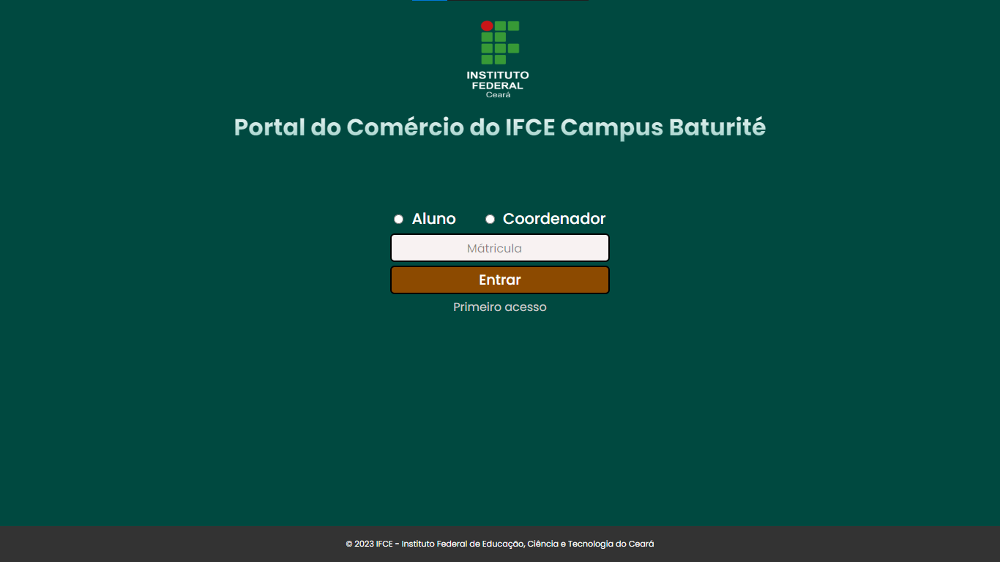

<h1 align="center">SAE Comércio IFCE Campus Baturité</h1>

<p align="center">
  
</p>

## 📒 Descrição

<p>
  O SAE é um sistema para os alunos do curso de Comércio do IFCE Campus Baturité possam adicionar suas atividades extracurriculares para completar a carga horaria exigida para efetuar o certificado de técnico em comércio. Para entrar os alunos precisam efetuar um login com a mátricula.
</p>

## 🔧 Tecnologias utilizadas

- React
- Styled-Components

## 💻 Pré-requisitos

Antes de começar, verifique se você atendeu aos seguintes requisitos:

- Você tem uma máquina `<Windows / Linux / Mac>`
- Node.js instalado. Você pode instalar o Node através [DESSE LINK](https://nodejs.org/en)

## 🚀 Como Executar o Projeto

```bash
# clone o repositório
$ git clone https://github.com/eupedrohenrique/SAE-comercio-ifce.git

# Entre na pasta do projeto
$ cd sae-comercio-ifce

# Instale as dependências
$ npm install

# Execute a aplicação
$ npm start
```

- A aplicação estará sendo executado em http://localhost:3000.

## 🎯 Status do projeto

O projeto está em desenvolvimento

## :memo: Licença

Esse projeto está sob a licença MIT. Veja o arquivo [LICENSE](https://github.com/eupedrohenrique/SAE-comercio-ifce/blob/main/LICENSE) para mais detalhes.
